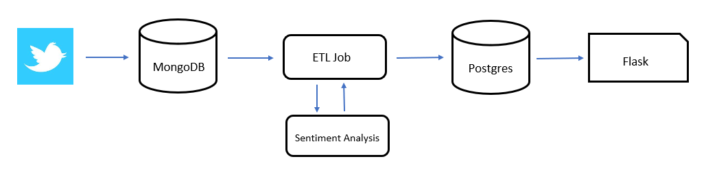

# Tweets Sentiment Analysis

## Synopsis
The goal of this project is to construct a data pipeline that analyzes the sentiment of tweets.

## Data Pipeline

### Tweets Collector
For collecting tweets, one needs Twitter credentials (register the application on apps.twitter.com and create *Access Tokens*). 

The tweets collector consists of:
- config.py: contains Twitter credentials --> Need to add your own credentials into this file
- twitter_streammer.py: handles authentication, listens in live tweets, filters tweets by keyword and language, parses the tweets for relevant data and loads the data into MongoDB database.

### MongoDB
The tweets collected in the first step, are stored in MongoDB (NoSQL database):
- It stores JSON documents
- Data is organized in collections
- Python can interact with MongoDB (*pymongo* library)

In this project, MongoDB runs in a Docker container, therefore it's not necessary to install the DB on the computer.

### ETL Job: Extract - Transform - Load
The tweets in MongoDB are extracted from the database and analyzed when executing *etl_job.py* file. This code, reads the tweets, runs the sentiment analysis and saves the results in a PostGreSQL database.

In order to give the twitter collector module time to collect data, the ETL job process make use of the sleep function in Python.   

### Sentiment Analysis
This is done using the Vader Sentiment Analysis library 

>Valence Aware Dictionary and sEntiment Reasoner is a lexicon and rule-based sentiment analysis tool that is specifically attuned to sentiments expressed in social media, and works well on texts from other domains.

The results are saved in the Postgres database.

### PostGreSQL
The database will be in a Docker container, like with MongoDB, there is no need to install this DB on the computer.

### Visualization of the analysis
This is done using Flask, which is a web framework written in Python. The results can be visualized in a web browser (localhost)

## Implementation: Docker

